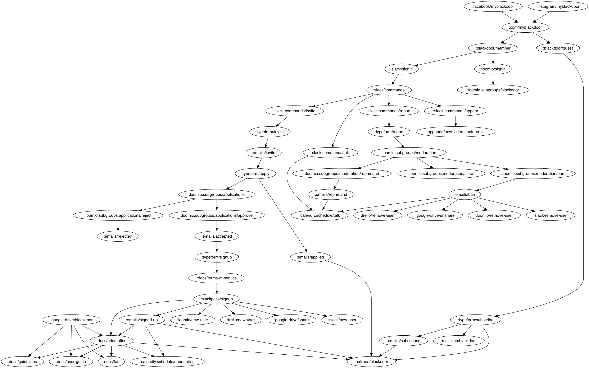
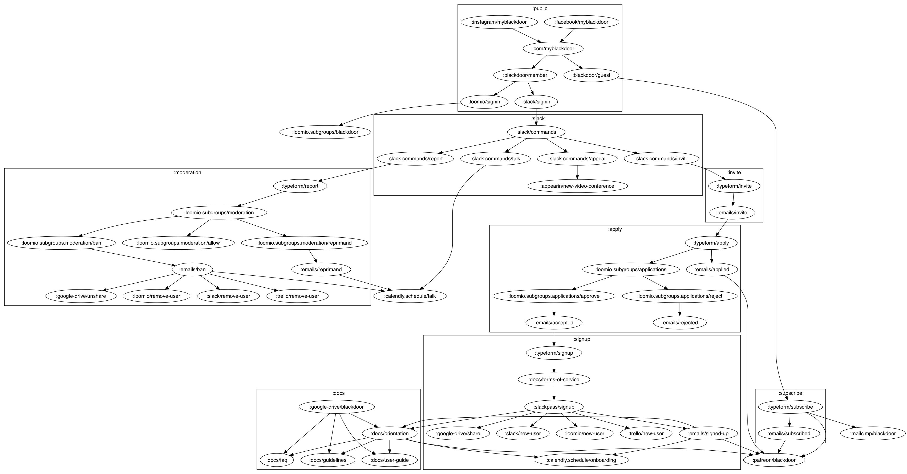
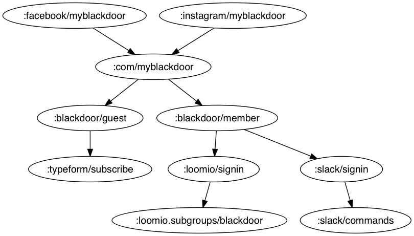

# blackdoor-flow-charts

make sure to init submodules

install graphviz following instructions on the [rhizome github](https://github.com/ztellman/rhizome).

to start repl

```
boot cider dev
```

# Alpha Test



grouped by user flows



grouped by service


# Alpha Flows

## Public

## Subscribe

## Invite

## Apply

## Signup

## Docs

## Moderation

## Slack


